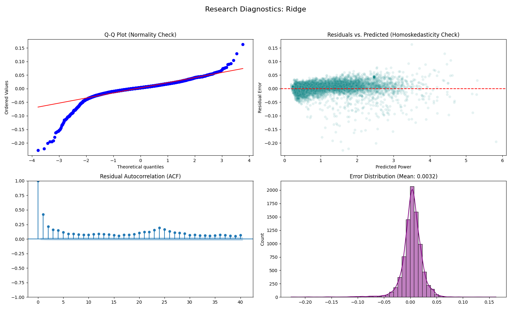

# Server Power Forecasting

Forecasts hourly server power consumption 24 hours ahead for capacity planning. Compares linear, tree-based, and deep learning models to find the most efficient approach.

**Stack:** Python, Scikit-Learn (Ridge), LightGBM, XGBoost, PyTorch (LSTM), Statsmodels (ADF Test), Walk-Forward Validation

## Overview

Optimizing data center cooling requires accurate load forecasting. This project ingests minute-level sensor data, resamples to hourly aggregates, and predicts future usage from historical patterns.

Four algorithms were compared:
1. Ridge Regression (linear baseline)
2. LightGBM (gradient boosting)
3. XGBoost (gradient boosting)
4. LSTM (recurrent neural network)

## Approach

- Data pipeline streams ~2M rows of UCI power consumption data, verifies integrity, and resamples
- Feature engineering transforms the time-series into a supervised learning problem using sliding windows (lags 1–24) and rolling statistics
- Walk-forward validation (3 expanding time windows) ensures the model is tested on future data, respecting temporal order

## Results

After a grid search over 114 configurations (with 3-fold walk-forward validation each), the simpler linear model performed best:

| Model | RMSE | Training Time |
| :--- | :--- | :--- |
| Ridge Regression | 0.0201 | < 1s |
| LightGBM | 0.0294 | ~5s |
| XGBoost | 0.0300 | ~8s |
| LSTM | 0.2720 | ~5m |

### Why Ridge Won
The feature engineering (24-hour lag and rolling means) captured the signal so well that the relationship became largely linear. Ridge weighted these features effectively without overfitting. The tree models slightly overfit the noise, and the LSTM struggled to converge on this sample size.

## Diagnostics

Statistical tests to validate assumptions:
- Stationarity: Augmented Dickey-Fuller test confirmed stationarity after differencing (p < 0.05)
- Residuals: not perfectly Gaussian — some extreme power spikes remain hard to predict for all models



## How to Run

1. Install dependencies:
```bash
pip install -r requirements.txt
```

2. Run the pipeline:
```bash
python main.py
```

This downloads the data, processes features, runs the full benchmark, and saves results to `logs/`.

---

Requires Python 3.11.

**Data Source:**

> Hébrail, G., & Bérard, A. (2012). Individual household electric power consumption [Dataset]. UCI Machine Learning Repository. https://doi.org/10.24432/C58K54
